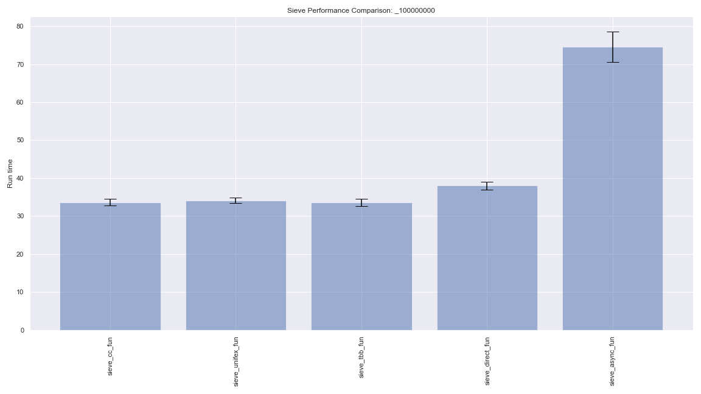
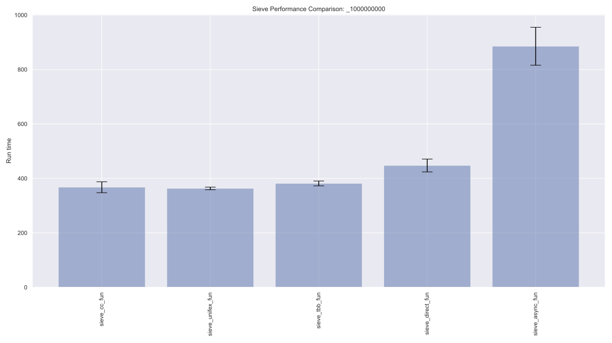

# Comparing parallel asynchronous frameworks with prime sieve

This repo contains multiple asynchronous implementations of sieve of Eratosthenes. 
## Block Sieve

The sieve of Eratosthenes is a well-known (and ancient) algorithm for finding prime numbers.  The algorithm maintains a list of all numbers up to a certain value.  Starting at 2, the algorithm finds the next number in the list that has not been crossed off and then crosses off all multiples of that number from the list.  If we maintain the list of numbers as a bitmap, with true meaning a number is prime, we just iterate through the list with a stride equal to the current prime, setting each corresponding location to false.

A simple sequential implementation might look like the following:
```c++
template <class bool_t>
auto sieve_seq(size_t n) {
  std::vector<bool_t> sieve(n, true);

  sieve[0] = sieve[1] = true;

  size_t sqrt_n = static_cast<size_t>(std::ceil(std::sqrt(n)));

  for (size_t i = 2; i < sqrt_n; ++i) {
    if (sieve[i]) {
      for (size_t j = i * i; j < n; j += i) {
        sieve[j] = false;
      }
    }
  }

  return sieve;
}
```

For the parallel implementations in this repository, instead of processing the entire list of numbers, we first sequentially determine all the primes in $[2, \sqrt(n))$.  Using that initial set of primes, the algorithm finds primes in fixed-size blocks of numbers, delimited by $[\sqrt{n}+p\times B, \sqrt{n} + (p+1)\times B)$, where $B$ is a given block size and $p = 0, 1, \ldots , n/B$.
The blocks can be processed independently and in parallel.


The computation is broken into five tasks:                                                                                       
1. `input_body()` generates p, a sequence of integers, starting at 0

2. `gen_range()` creates a bitmap for indicating primality (or not)   

3. `range_sieve()` applies sieve, to block $p$, using initial set of        
$\sqrt{n}$ primes and records results in bitmap obtained from           
      `gen_range()`

4. `sieve_to_primes_part()` generates a list of prime numbers from the
bitmap generated by `range_sieve()`
    
5. `output_body()` saves the list of primes in a vector at location $p+1$.

The original set of $\sqrt{n}$ primes is stored at loccation 0.

A set of $n/B$ parallel task chains is launched to carry out the computation.
                                                                                                                                   
## Frameworks

The various implementations included here are based on the same block algorithm and use essentially the same functions.  They differ, however, in how concurrency and parallelism are effected.
- **async**: Uses `std::async` and `std::future` for concurrency and parallelism.  Algorithmic steps are chained together via `std::async()` and `std::future.get()`.
- **cc**: Uses the `concurrencpp` library, based on C++20 coroutines for concurrency and parallelism.  Algorithmic steps are chained together via `co_return` and `co_await`
- **direct**: Algorithmic steps are chained together via one function directly using the results of the previous one.  Function call chains are launched as separate `std::async` tasks.
- **p2300**: Uses WG21 P2300 `std::execution` for concurrency and parallelism.  Algorithmic steps are chained together with `std::execution` and `operator|`.
- **tbb**: Uses Intel Threading Building Blocks (oneTBB) for concurrency and parallelism.  Algorithmic steps are embedded in `tbb::flow` task graph nodes.

The associated driver programs are named `sieve_<framework>_fun.cpp`.  (The "fun" is due not only to this being fun but because the driver is based on composing free functions together.  There are also "obj" variants, based on function objects, not yet copied here.)


## Prerequisites

### concurrencpp and std::execution

Pull in the concurrencpp and wg21_p2300_std_execution submodules with git

```bash
  $ git submodule update --init --recursive
```


### concurrencpp 

One of the implementations uses the concurrencpp library.  
Get the latest version of concurrencpp as a submodule (the
Makefile expects it to be installed as a subdirectory).

Build the library:
```bash
  $ cd concurrencpp
  $ mkdir build
  $ cd build
  $ cmake ..
  $ make
```

That should create a library `libconcurrencpp.a` in the `concurrencpp/build` subdirectory.

### `std::execution`

`std::execution` is header-only so it should "just work".  Double check Makefile macros if things are not found (see below).

### TBB

You will need a recent version of Intel Threading Building Blocks -- oneTBB.  The most
straightforward way to access that is to install it with the appropriate package manager 
(brew on MacOS, apt on Ubuntu, etc).

### Makefile

There are a few macros in the Makefile that you may need to set.

`P2300` should point to the top level of the wg21_p2300_std_execution repository.
This will be pulled in as a submodule, and the Makefile should already point to it.  But if you want to use a different location, you can update that.

`TBBROOT` should point to the top level of your TBB installation.  On recent Linux this may be

```make
TBBROOT		:= /opt/intel/oneapi/tbb/2021.5.1
```

(which is what is set in the Makefile for Linux).  For recent MacOS this may be

```make
TBBROOT		:= $(HOMEBREW)/tbb/2021.5.0
```

where `HOMEBREW` may be one of `/opt/homebrew` or `/usr/local/Cellar`.

(I realize that cmake can deal with much of this -- it's on the to-do list.)


### Compiler

The concurrencpp library has only been tested with Apple clang, it does not appear to build with g++ (g++-11 attempted).  The other executables should build with g++-11.

## Building and Running

The suite of executables can be built with

```bash
  $ make
```
This will build all of the `sieve_<framework>_fun.exe`.  

The executables are invoked as

```bash
  $ ./sieve_<framework>_fun.exe [problem_size] [block_size]
```
where `problem_size` is an optional argument specifying the upper limit of numbers to search for primes and `block_size` is how many thousands of numbers to process together in a block.  Default `problem_size` is `100'000'000` and default `block_size` is `100`.  

(In initial benchmarks a `block_size` of `100` seems to offer the best performance.)

The program will run the sieve program twice: once using a bitmap of `std::vector<bool>` and once using a bitmap of `std::vector<uint8_t>`.  (This remains for historical reasons to compare efficiency of using `bool` for `uint8_t` for bitmaps.)

## Benchmarking

A jupyter notebook is available in the benchmarks subdirectory

```bash
  $ cd benchmarks
  $ jupyter notebook sieve_benchmark.ipynb
```

This will build, run, and plot the benchmarks.  Assuming everything will build and run properly, it will take about 45 minutes to run through all the benchmarking.


## Results

### Experimental Setup

The following results were obtained on a Mac Mini M1, 2020 with 8 cores (4 performance, 4 efficiency).  The programs were compiled with Apple Clang version 13.0.0 for arm64-apple-darwin20.6.0.  Optimization flags used were "-Ofast -mcpu=apple-m1".  The TBB used was oneTBB (2021.5.0).  The concurrencpp version was v.0.1.4.  The std_execution version was P2532R0-46-gd40ce5e.


### Primes less than 100'000'000



Shown from left to right are execution times for sieve implementations using concurrencpp, TBB, direct function calls, std::async, and P2300 std::execution.  These results were obtained with a block size of 100k numbers.  Each bar shows mean and standard deviation over a total of 16 runs for each implementation.

### Primes less than 1'000'000'000



Shown from left to right are execution times for sieve implementations using concurrencpp, TBB, direct function calls, std::async, and P2300 std::execution.  These results were obtained with a block size of 100k numbers.  Each bar shows mean and standard deviation over a total of 16 runs for each implementation.