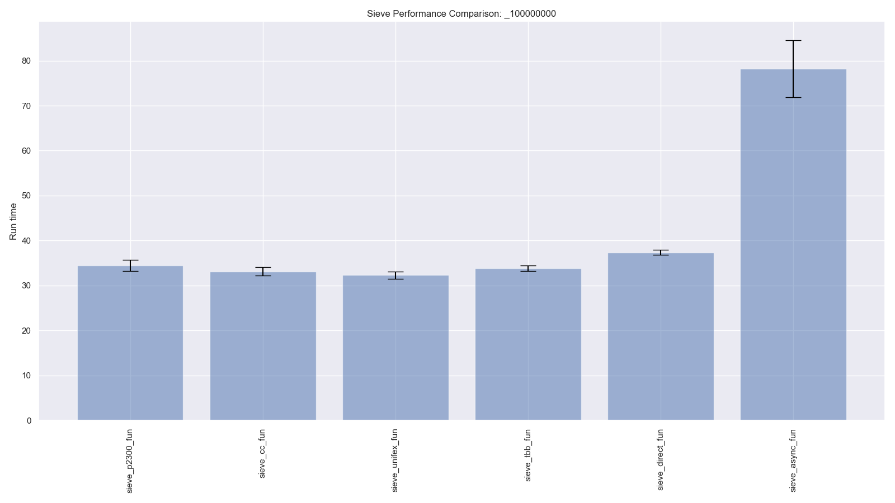
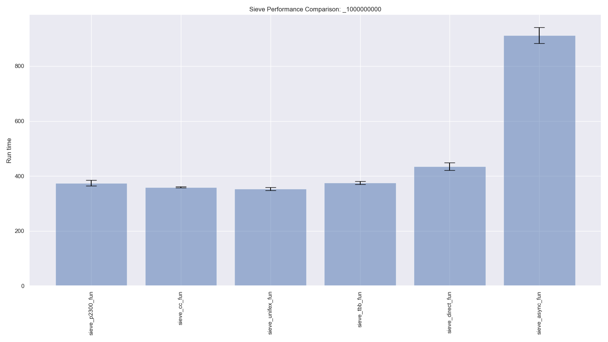

# Comparing parallel asynchronous frameworks with prime sieve

This repo contains multiple asynchronous implementations of sieve of Eratosthenes. 
## Block Sieve

The sieve of Eratosthenes is a well-known (and ancient) algorithm for finding prime numbers.  The algorithm maintains a list of all numbers up to a certain value.  Starting at 2, the algorithm finds the next number in the list that has not been crossed off and then crosses off all multiples of that number from the list.  If we maintain the list of numbers as a bitmap, with true meaning a number is prime, we just iterate through the list with a stride equal to the current prime, setting each corresponding location to false.

A simple sequential implementation might look like the following:
```c++
template <class bool_t>
auto sieve_seq(size_t n) {
  std::vector<bool_t> sieve(n, true);

  sieve[0] = sieve[1] = true;

  size_t sqrt_n = static_cast<size_t>(std::ceil(std::sqrt(n)));

  for (size_t i = 2; i < sqrt_n; ++i) {
    if (sieve[i]) {
      for (size_t j = i * i; j < n; j += i) {
        sieve[j] = false;
      }
    }
  }

  return sieve;
}
```

For the parallel implementations in this repository, instead of processing the entire list of numbers, we first sequentially determine all the primes in 
.
Using that initial set of primes, the algorithm finds primes in fixed-size blocks of numbers, delimited by $[\sqrt{n}+p\times B, \sqrt{n} + (p+1)\times B)$, where $B$ is a given block size and $p = 0, 1, \ldots , n/B$.
The blocks can be processed independently and in parallel.


The computation is broken into five tasks:                                                                                       
1. `input_body()` generates p, a sequence of integers, starting at 0

2. `gen_range()` creates a bitmap for indicating primality (or not)   

3. `range_sieve()` applies sieve, to block $p$, using initial set of        
$\sqrt{n}$ primes and records results in bitmap obtained from           
      `gen_range()`

4. `sieve_to_primes_part()` generates a list of prime numbers from the
bitmap generated by `range_sieve()`
    
5. `output_body()` saves the list of primes in a vector at location $p+1$.

The original set of $\sqrt{n}$ primes is stored at loccation 0.

A set of $n/B$ parallel task chains is launched to carry out the computation.
                                                                                                                                   
## Frameworks

The various implementations included here are based on the same block algorithm and use essentially the same functions.  They differ, however, in how concurrency and parallelism are effected.
- **async**: Uses `std::async` and `std::future` for concurrency and parallelism.  Algorithmic steps are chained together via `std::async()` and `std::future.get()`.
- **cc**: Uses the `concurrencpp` library, based on C++20 coroutines for concurrency and parallelism.  Algorithmic steps are chained together via `co_return` and `co_await`
- **direct**: Algorithmic steps are chained together via one function directly using the results of the previous one.  Function call chains are launched as separate `std::async` tasks.
- **p2300**: Uses WG21 P2300 `std::execution` for concurrency and parallelism.  Algorithmic steps are chained together with `std::execution` and `operator|`. 
- **tbb**: Uses Intel Threading Building Blocks (oneTBB) for concurrency and parallelism.  Algorithmic steps are embedded in `tbb::flow` task graph nodes.
- **unifex**: Uses Facebook's `libunifex` for concurrency and parallelism.  Algorithmic steps are chained together with `unifex::then` and `operator|`.

The associated driver programs are named `sieve_<framework>_fun.cpp`.  (The "fun" is due not only to this being fun but because the driver is based on composing free functions together.  There are also "obj" variants, based on function objects, not yet copied here.)


## Prerequisites

### concurrencpp, tbb, and  std::execution

Pull in the concurrencpp, libunifex, tbb, and wg21_p2300_std_execution submodules with git

```bash
  $ git submodule update --init --recursive
```

### Run cmake

```bash
  $ mkdir build
  $ cd build
  $ cmake ..
```

Options available for this project in  CMakeLists.txt include

| Option              | Description                                        | Default |
| --------------------|----------------------------------------------------|---------|
| EC_BUILD_SIEVE      | Option to build sieve demo programs                | ON      |
| EC_USE_CONCURRENCPP | Option whether or not to use concurrencpp library  | ON      |
| EC_USE_WG21_P2003   | Option whether or not to use std execution library | ON      |
| EC_USE_LIBUNIFEX    | Option whether or not to use libunifex             | ON      |
| EC_USE_TBB          | Option whether or not to use TBB                   | ON      |
| EC_USE_LOCAL_TBB    | Use TBB submodule (rather than system TBB)         | ON      |


### Compiler

Important.  Several submodules (concurrencpp and wg1_21_p2003) in the project depend on C++20 and other features supported by clang compilers but not by GNU.  The examples all compile with Apple clang, but will not compile with g++.  cmake will disable those libraries if it detects g++.  I haven't tried out any clang compilers other than Apple clang, but since Apple clang is usually behind mainstream clang, I expect it will work (or will only require small changes).  Everything should work with taskflow and with TBB.


Right now, cmake just picks the default compilation flags for the build level.  If you want a different set of flags, you will (for now) need to set them.  For example:

    $ cmake -DCMAKE_BUILD_TYPE=Release -DCMAKE_CXX_BUILD_FLAGS="-Ofast -march=native"

By default, all of the demos will be built: kite, sieve, and eval.  You can turn those off with DAG_BUILD_EVAL, DAG_BUILD_KITE, or DAG_BUILD_SIEVE options.  The default is ON for all.

### TBB

A few of the executables depend on TBB.  Right now, TBB is included as a submodule.  You can either use a system install of TBB (use your favorite package manager to install), or use the submodule.  To use the submodule

    $ cmake -DDAG_USE_LOCAL_TBB=ON

The default is ON.

## Building and Running

The suite of executables can be built with

```bash
  $ make
```
This will build all of the `sieve_<framework>_fun.exe` and put them in ./build/bin.

From the build subdirectory, the executables can be invoked as:

```bash
  $ ./bin/sieve_<framework>_fun.exe [problem_size] [block_size]
```
where `problem_size` is an optional argument specifying the upper limit of numbers to search for primes and `block_size` is how many thousands of numbers to process together in a block.  Default `problem_size` is `100'000'000` and default `block_size` is `100`.  

(In initial benchmarks a `block_size` of `100` seems to offer the best performance.)

The program will run the sieve program twice: once using a bitmap of `std::vector<bool>` and once using a bitmap of `std::vector<uint8_t>`.  (This remains for historical reasons to compare efficiency of using `bool` for `uint8_t` for bitmaps.)

## Benchmarking

A jupyter notebook is available in the benchmarks subdirectory

```bash
  $ cd benchmarks
  $ jupyter notebook sieve_benchmark.ipynb
```

This will build, run, and plot the benchmarks.  Assuming everything will build and run properly, it will take about 10 minutes to run through all the benchmarking.


## Results

### Experimental Setup

The following results were obtained on a Mac Mini M1, 2020 with 8 cores (4 performance, 4 efficiency).  The programs were compiled with Apple Clang version 13.0.0 for arm64-apple-darwin20.6.0.  Optimization flags used were "-Ofast -mcpu=apple-m1".  The TBB used was oneTBB (2021.5.0).  The concurrencpp version was v.0.1.4.  The std_execution version was P2532R0-46-gd40ce5e.


### Primes less than 100'000'000



Shown from left to right are execution times for sieve implementations using concurrencpp, libunifex, TBB, direct function calls, and std::async.  These results were obtained with a block size of 100k numbers.  Each bar shows mean and standard deviation over a total of 16 runs for each implementation.

### Primes less than 1'000'000'000



Shown from left to right are execution times for sieve implementations using concurrencpp, libunifex, TBB, direct function calls, and std::async.  These results were obtained with a block size of 100k numbers.  Each bar shows mean and standard deviation over a total of 16 runs for each implementation.
